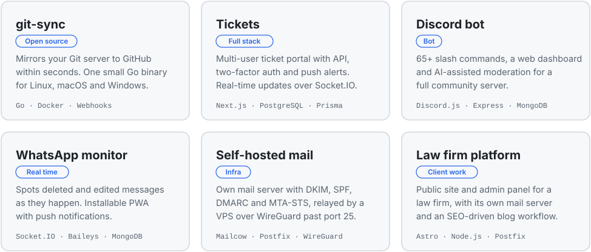
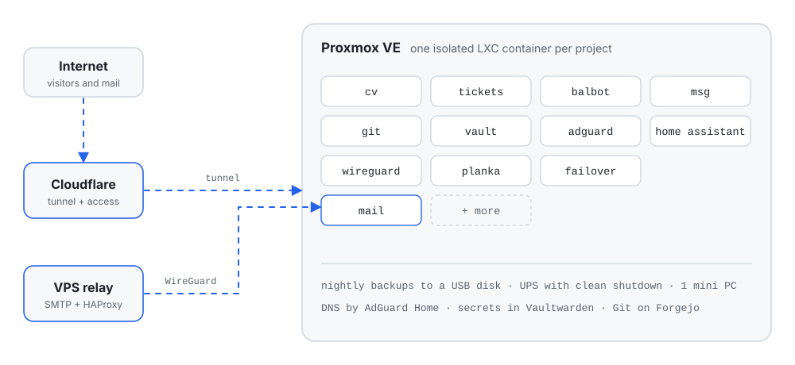
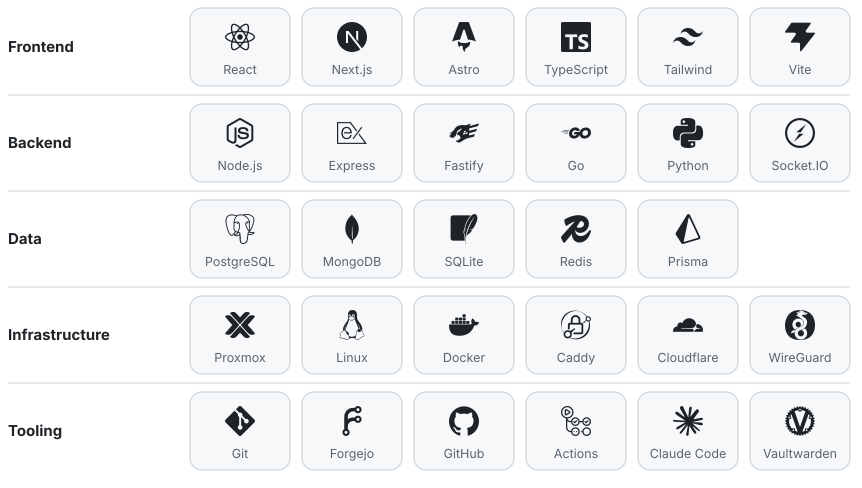

<picture>
  <source media="(prefers-color-scheme: dark)" srcset="assets/hero-dark.svg">
  
</picture>

 

  I build complete web apps and run them on my own hardware. 
  Full stack at a law firm by day, systems and networks student by schedule, homelab keeper by compulsion.

  <a href="https://cristobaltormo.com"><picture><source media="(prefers-color-scheme: dark)" srcset="assets/pill-web-dark.svg"></picture></a>
  <a href="https://www.linkedin.com/in/cristobaltormo"><picture><source media="(prefers-color-scheme: dark)" srcset="assets/pill-linkedin-cristobaltormo-dark.svg"></picture></a>
  <a href="mailto:info@cristobaltormo.com"><picture><source media="(prefers-color-scheme: dark)" srcset="assets/pill-mail-dark.svg"></picture></a>

 

  <picture>
    <source media="(prefers-color-scheme: dark)" srcset="assets/terminal-dark.svg">
    
  </picture>

## What I build

  <picture>
    <source media="(prefers-color-scheme: dark)" srcset="assets/projects-dark.svg">
    
  </picture>

The one you can read is **[git-sync](https://github.com/cristobaltormo/git-sync)**, my open source Git mirroring daemon: Apache-2.0, tested against seven Git servers, and the reason this profile lives on GitHub at all. The rest is in private repositories, but the [CV site](https://cristobaltormo.com) tells their story.

## How it is wired

  <picture>
    <source media="(prefers-color-scheme: dark)" srcset="assets/homelab-dark.svg">
    
  </picture>

Everything I ship runs on one mini PC at home, one container per project, behind a UPS and a nightly backup. My ISP blocks port 25, so outgoing mail leaves through a VPS over WireGuard. It is more infrastructure than most side projects need, which is exactly why it is a good classroom.

## Toolbox

  <picture>
    <source media="(prefers-color-scheme: dark)" srcset="assets/stack-dark.svg">
    
  </picture>

 

  Spanish (native)  ·  English (B2)  ·  Valencian (B1) 
  Every graphic here is a hand-built SVG, generated by <a href="scripts/build_assets.py">scripts/build_assets.py</a>. No widgets, no third-party services.

